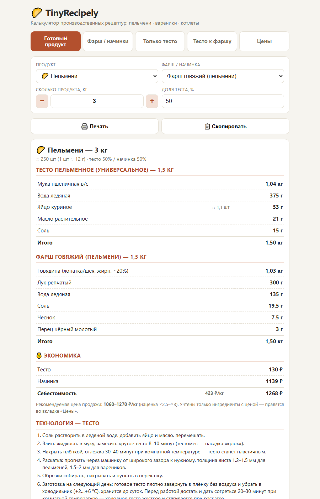
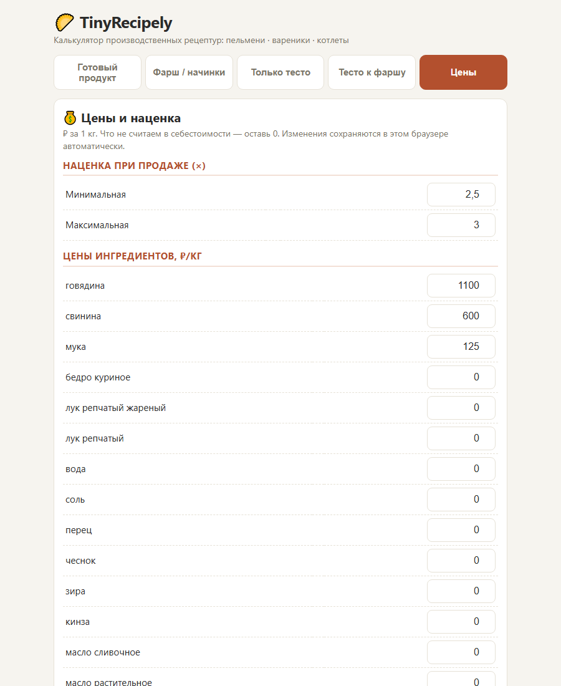

# 🥟 TinyRecipely

Калькулятор производственных рецептур для домашних полуфабрикатов: пельмени, вареники, хинкали, манты, чебуреки, котлеты, тефтели, сырники + тесто для пиццы.

**▶ Открыть калькулятор: https://gmaker.github.io/TinyRecipely/**

Статичное веб-приложение без бэкенда: вводишь нужные килограммы (шаг 0,5) — получаешь точную раскладку ингредиентов, технологию и себестоимость. Результат можно распечатать или скопировать текстом (формат под мессенджеры).



## Возможности

- **Готовый продукт** — вводишь кг пельменей/вареников/чебуреков и т.д., калькулятор раскладывает на тесто и фарш с граммовками. Доля теста настраивается.
- **Фарш / начинки** — рецепт на N кг любого фарша или начинки (17 видов: мясные для пельменей/хинкали/мантов/чебуреков, котлетные, тефтельные, вареничные начинки от картошки до вишни, масса для сырников).
- **Только тесто** — 5 видов: пельменное, хинкальное, чебуречное заварное, пицца быстрая и пицца холодного брожения.
- **Тесто к фаршу** — обратный сценарий: есть заготовка фарша (мясо + лук), калькулятор считает, сколько досыпать соли/специй/воды и сколько замесить теста.
- **Цены** — себестоимость и рекомендованная цена продажи. Цены ингредиентов и наценка правятся прямо в интерфейсе, сохраняются в браузере.



## Структура

```
index.html          — разметка
js/app.js           — логика пересчёта
css/style.css       — стили + версия для печати
data/recipes.json   — все рецептуры (раскладки на 1000 г готовой массы)
data/prices.json    — стартовые цены ингредиентов, ₽/кг
```

Рецептуры и цены — просто JSON: правишь граммовки, добавляешь новые начинки и продукты без изменения кода.

## Запуск локально

Любой статичный сервер, например:

```bash
python -m http.server 8088
```

и открыть http://localhost:8088 (через `file://` не работает — рецепты грузятся fetch-ем).
